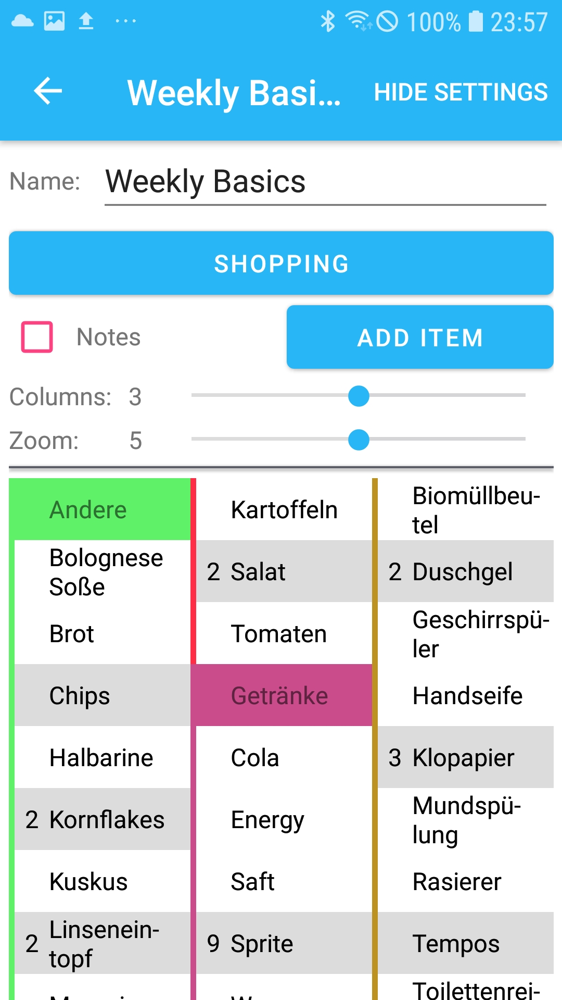
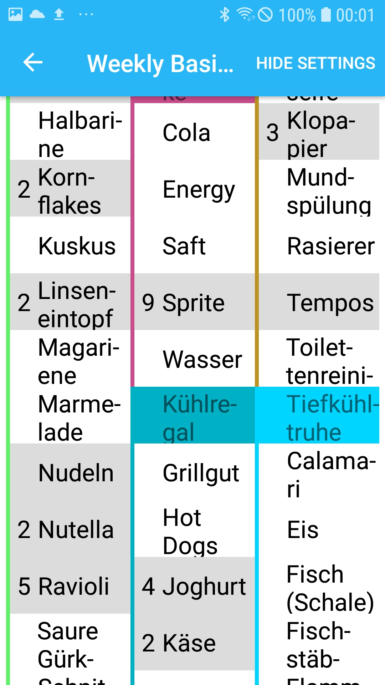

= Shopping List Server

== Overview

The Shopping List Server is an ASP.NET Core Web API designed to support a shopping list application. It provides comprehensive user management, authentication, shopping list creation and sharing, real-time updates via SignalR, push notifications through Firebase Cloud Messaging (FCM), email verification, and secure file storage. The server uses Entity Framework Core for database interactions with support for both MySQL and SQLite, and includes Docker deployment options for scalability.

This project enables users to create, manage, and share shopping lists with fine-grained permissions, authenticate via JWT or social providers (Google, Facebook, Apple), and receive real-time notifications about list changes.

*Future Plans*: A React-based frontend is planned to provide a modern web interface complementing the existing mobile app.

== App Screenshots

The Shopping List Server powers a mobile app with the following key screens:






== Features

* **User Management**: Registration, authentication, profile updates, and contact management. Supports social logins (Google, Facebook, Apple) and email verification.
* **Authentication**: JWT-based authentication with support for external OAuth2 providers. Includes password hashing with salt, alternative passwords, and secure token management.
* **Shopping Lists**: Create, update, delete, and share shopping lists. Supports permissions for read, write, delete, and member management.
* **Permissions System**: Fine-grained access control using bit flags (e.g., Read, Write, Delete, AddPermission, ModifyPermission) for shopping list sharing.
* **Real-Time Updates**: SignalR integration for live synchronization of shopping list changes across connected clients.
* **Push Notifications**: Firebase Cloud Messaging (FCM) for sending notifications to users' devices about list updates.
* **Email Services**: Automated email verification, password reset, and HTML email templates using SMTP.
* **File Storage**: User-specific file storage for profile pictures and other data, managed via FilesystemService with secure path handling.
* **Database Migrations**: Entity Framework Core migrations for schema evolution, supporting both MySQL and SQLite databases.
* **Security**: HTTPS redirection, CORS support, secure handling of sensitive data, and environment-specific configurations.
* **Deployment**: Docker support for containerized deployment, with options for local development and external server production.

== Key Concepts

* **Entities and Models**:
  - [`User`](Models/User.cs): Represents users with properties like email, name, color, verification status, and FCM tokens.
  - [`ShoppingList`](Models/ShoppingData/ShoppingList.cs): Core shopping list entity with items, permissions, and metadata.
  - [`ShoppingListPermission`](Models/ShoppingData/ShoppingListPermission.cs): Manages user permissions for lists.
  - [`FcmToken`](Models/FcmToken.cs): Stores Firebase tokens for push notifications.
  - [`ImageInfo`](Models/ImageInfo.cs): Handles user profile images.
  - [`UserContact`](Models/UserContact.cs): Manages user contacts and sharing.
  - [`EMailVerificationToken`](Models/EMailVerificationToken.cs): Handles email verification tokens.

* **Services Layer**: Business logic is encapsulated in services with dependency injection:
  - [`UserService`](Services/UserService.cs): User CRUD operations and contact management.
  - [`AuthenticationService`](Services/AuthenticationService.cs): JWT token generation and validation.
  - [`PushNotificationService`](Services/PushNotificationService.cs): FCM integration for notifications.
  - [`ShoppingService`](Services/ShoppingService.cs): Shopping list operations and permissions.
  - [`EMailVerificationService`](Services/EMailVerificationService.cs): Email verification and templates.
  - [`FilesystemService`](Services/FilesystemService.cs): Secure file storage and management.

* **Controllers**: API endpoints handle HTTP requests:
  - [`UsersController`](Controllers/UsersController.cs): User authentication, registration, and management.
  - [`ShoppingController`](Controllers/ShoppingController.cs): Shopping list CRUD and permissions.
  - [`VerifyController`](Controllers/VerifyController.cs): Email verification endpoints.
  - [`ShoppingHub_Controller`](Controllers/ShoppingHub_Controller.cs): SignalR hub for real-time updates.

* **Database Context**: [`AppDb`](Database/AppDb.cs) manages database operations with lazy loading, UTC time conversion, and migration support.

* **Authentication Flow**: JWT tokens for session management with claims-based authorization. Social authentication via OAuth2 with provider-specific models (GoogleUser, FacebookProfile, AppleAccount).

* **Permissions**: Enum-based flags for shopping list access, allowing combinations like WriteAndAddPermission. Permissions are checked at the service layer.

* **Hubs**: SignalR hubs for real-time communication between clients and server, enabling live updates on shopping list changes.

* **Email and Notifications**: HTML page generation for emails using [`HtmlPageFactory`](Logic/HtmlPageFactory.cs), FCM integration for push messages.

* **File Handling**: Storage paths for user data with folder creation and management in [`Files`](Files/) directory.

* **Error Handling**: Global exception handling with custom status messages in [`StatusMessages.cs`](Models/StatusMessages.cs).

* **Configuration**: Environment-specific settings in [`appsettings.json`](appsettings.json) and [`appsettings.Development.json`](appsettings.Development.json), with secrets isolated in [`auth/`](auth/) folder.

== Setup and Workflows

=== Prerequisites

* .NET 8.0 SDK
* MySQL or SQLite database
* Docker (for containerized deployment)
* Firebase project (for push notifications)
* Email server credentials (for SMTP)

=== Local Server Setup

1. Edit [`appsettings.Development.json`](appsettings.Development.json):
   - Set database connection: `"DbServerAddress": "server=localhost"` for local MySQL or use SQLite.
   - Disable HTTPS: Change URL in [`Program.cs`](Program.cs) to `"http://0.0.0.0:5678"`.

2. Install dependencies:
   ```
   dotnet restore
   ```

3. Run migrations:
   ```
   dotnet ef database update
   ```

4. Start the server:
   ```
   dotnet run
   ```

Test connectivity:
```
curl -I http://localhost:5678/users/test
```

=== External Server with Docker

1. Edit [`appsettings.json`](appsettings.json):
   - Set `"UseDocker": "True"`.
   - Configure database and certificates.

2. Place SSL certificates in `/etc/letsencrypt/kestrel/` (copy from Certbot live folder).

3. Set Docker host (if deploying remotely):
   ```
   export DOCKER_HOST=ssh://<user>@<server>
   ```

4. Initial deployment:
   ```
   docker-compose up --build && docker-compose rm -fsv
   ```

5. Update server code:
   ```
   docker-compose up -d --no-deps --build shoppinglistserver
   ```

Test with:
```
curl -I https://<certbot-address>:5678/users/test
```

=== External Server without Docker

1. Install MySQL on the server and create schema/user as per [`appsettings.json`](appsettings.json).
2. Place certificates in the specified paths.
3. Build and run:
   ```
   dotnet publish -c Release
   dotnet ShoppingListServer.dll
   ```

=== Database Setup

- Create schema: `CREATE SCHEMA shoppinglistserver;`
- Grant user access.
- Migrations are applied automatically on startup. Manual update:
  ```
  dotnet ef database update
  ```
- Add new migrations:
  ```
  dotnet ef migrations add <MigrationName>
  ```

== API Documentation

=== REST Endpoints

* **Authentication**:
  - `POST /users/authenticate`: Authenticate user (public).
  - `POST /users/register`: Register user (public).

* **Users**:
  - `GET /users`: Get all users (admin only).
  - `GET /users/{id}`: Get user by ID (authenticated).
  - `PUT /users`: Update user (authenticated).
  - `POST /users/generate_share_id`: Generate contact share ID (authenticated).
  - `POST /users/contact/{userId}`: Add/remove contact (authenticated).

* **Shopping Lists**:
  - `POST /shopping/list`: Create/update list (authenticated).
  - `GET /shopping/list/{id}`: Get list (authenticated).
  - `DELETE /shopping/list/{id}`: Delete list (authenticated).
  - `POST /shopping/test_firebase_push_message`: Test FCM (anonymous).

* **Verification**:
  - `GET /verify/em/{urlCode}`: Verify email (anonymous).

=== SignalR

Connect to `/shoppingserver/update` for real-time updates on shopping list changes.

== Contributing

Contributions are welcome. Follow standard .NET practices, ensure tests pass, and update migrations as needed.

== License

This project is licensed under the MIT License. See [`LICENSE`](LICENSE) for details.</content>
<parameter name="filePath">/home/jonas/Git/Shopping_List_Server/README.adoc